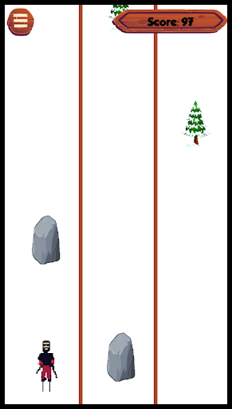
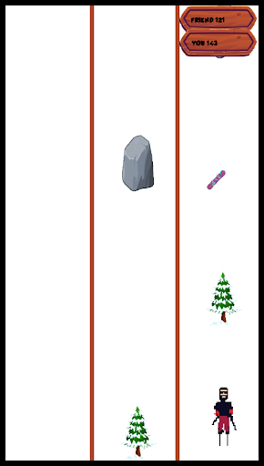
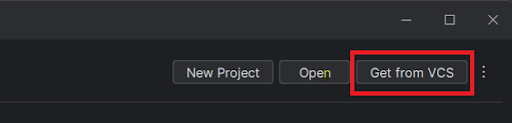
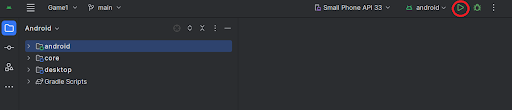
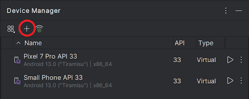

# Avalanche Rush

Avalanche rush is an endless runner game, where the player has to flee from an avalanche while avoiding obstacles, it is inspired by the well-known game "Subway Surfers" but with the addition of a multiplayer mode.

As with Subway Surfers, there are obstacles which must be avoided (trees) by moving in the three different lanes thanks to the tapping function or jumped through the double tap function (rocks), power ups, such as the helmet (allowing you to hit an obstacle without dying) and the snowboard (doubles the score that is obtained for a limited time), all this to try to get the highest possible score.

The multiplayer mode shares the same game mechanics as the single player, however allowing you to challenge a friend, through the creation of a game lobby with a unique code, to see who gets the highest score.
Score sharing occurs through a real-time multiplayer function provided by FireBase Database.

## Contributors
* Alicja Jonczyk
* Kacper Multan
* Arianna Moser
* Margaux Xu
* Gagan Gupta
* Nicolò Costa

## License
This project is available under a closed license. All rights reserved.

## Requirements
Android Studio with an emulator / android device

## Installation
### APK
From the GitHub folder download the APK and install it on your device

### Android Studio
Download and open the latest version of Android Studio. Now import the project by copying the link from the GitHub folder and pasting it into “Get from VCS -> URL”

Press the green triangle button to run the game

Now the game should run on the default Android Studio emulator, but if you want you can add one of your own by going to "Menu -> Tools -> Device Manager" or connect your Android device to the computer and play it from there

